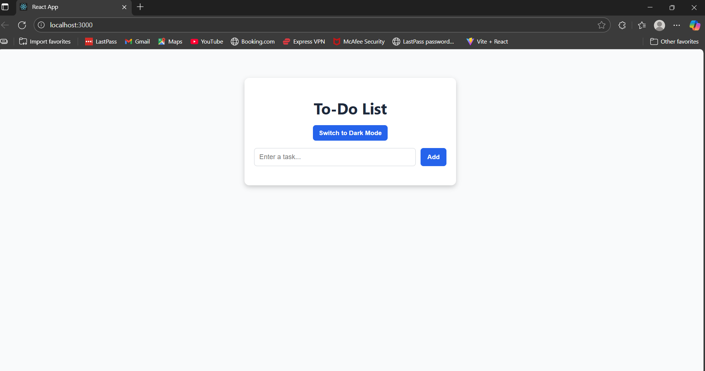
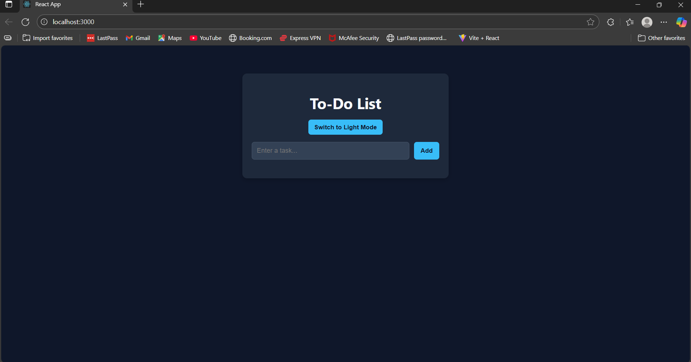

# 📝 To-Do List App

A simple and responsive **To-Do List Application** built using **React.js**.  
Includes **Light & Dark Mode**, task completion, and delete functionality.  

---

## 🚀 Features
- Add new tasks
- Mark tasks as complete/incomplete
- Delete tasks
- Light & Dark theme toggle 🌙☀️
- Clean & modern UI with smooth transitions

---

## 📸 Screenshots
### Light Mode


### Dark Mode


---

## 🛠️ Tech Stack
- **React.js**
- **CSS (custom, no Tailwind used)**

---

## ⚡ Installation & Setup

1. Clone the repo:
   ```bash
   git clone https://github.com/your-username/to_do_list.git
   cd to_do_list
